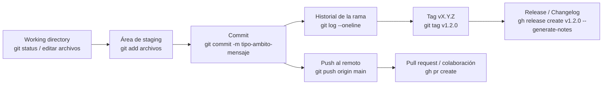

# Git Conventional

Skill de agente de IA open-source para aprender y gestionar versionamiento de proyectos con Git, Semantic Versioning y Conventional Commits.

Compatible con cualquier agente que soporte `SKILL.md` (OpenClaw, Claude Code, Codex, Cursor y más de 50 más).

## Instalar

```bash
npx skills add VanessaPellegrini/git-conventional
```

## Qué ayuda a hacer

| Funcionalidad | Descripción |
|---------------|-------------|
| Auditoría de versionado | Detecta si el repositorio ya está versionado e identifica su estado actual |
| Setup de Git | Inicializa un repositorio, agrega `.gitignore` y prepara el primer commit |
| GitHub CLI | Instala y configura `gh` para trabajar con PRs, releases e issues |
| Conventional Commits | Agrega convenciones de commits y validación con git hooks |
| Generación de changelog | Genera notas de release y changelogs desde el historial |

## Qué significa estar versionado

Un repositorio está versionado cuando tiene historial en Git y puede identificar releases mediante tags como `v1.2.0`.

## Por qué usar Conventional Commits

Los Conventional Commits hacen que el historial del proyecto sea más fácil de leer, automatizar y mantener.

- Generan changelogs automáticos.
- Permiten determinar automáticamente el incremento de versión semántica según el tipo de commit.
- Comunican la naturaleza de los cambios al equipo, a usuarios y a otras partes interesadas.
- Ayudan a disparar procesos de build y release de forma más confiable.
- Hacen más simple para nuevos colaboradores entender el historial del repositorio.

## Cómo viaja la información en Git

Puedes usar Git de forma manual o apoyarte en este skill. La skill ayuda a detectar el estado, elegir el siguiente paso y mantener un flujo consistente.



## Qué revisa la skill

1. Si el repositorio ya tiene Git.
2. Si el repositorio ya tiene tags.
3. Si el proyecto ya sigue una estrategia de versionamiento.
4. Si `gh` está disponible para trabajar con GitHub.
5. Si hace falta agregar o reforzar Conventional Commits.

## Ejemplo

```
Vos: "Necesito versionar este proyecto"
Agente: [carga git-conventional]
Agente: "Revisando estado actual... no hay repositorio Git, no hay tags, todavía no hay versionamiento."
Agente: "Ruta recomendada: inicializar Git, crear la primera versión y activar Conventional Commits."
```

```
Vos: "Creá un release para la nueva feature de auth"
Agente: "Desde el último tag (v1.1.0), hay 3 commits feat y 2 commits fix."
Agente: "Subiendo a v1.2.0. Creando tag y release en GitHub..."
```

## Conventional Commits

Cada commit sigue este formato:

```bash
<tipo>(<ámbito>): <descripción>
```

| Tipo | Impacto en la versión | Cuándo usarlo |
|------|-----------------------|---------------|
| `feat` | MINOR | Nueva funcionalidad |
| `fix` | PATCH | Corrección de bug |
| `docs` | none | Solo documentación |
| `style` | none | Formato |
| `refactor` | none | Reestructuración de código |
| `perf` | PATCH | Mejora de rendimiento |
| `test` | none | Agregar o actualizar tests |
| `chore` | none | Build, CI, herramientas |
| `ci` | none | Configuración de CI |
| `build` | none | Cambios del sistema de build |
| `!` o `BREAKING CHANGE` | MAJOR | Cambio incompatible |

## GitHub CLI

Si el proyecto usa GitHub, la skill instala `gh` y habilita:

```bash
gh pr create --title "feat: agregar búsqueda" --body "Agrega funcionalidad de búsqueda"
gh release create v1.2.0 --generate-notes
gh issue create --title "Bug: login falla en Safari"
```

## Contribuir

Proyecto abierto. Contribuciones bienvenidas.

## Licencia

MIT

---

_Hecho con curiosidad por Van & Purim 🐶_
