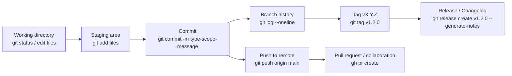

# Git Conventional

Open-source AI agent skill for learning and managing project versioning with Git, Semantic Versioning, and Conventional Commits.

Compatible with any agent that supports `SKILL.md` (OpenClaw, Claude Code, Codex, Cursor, and 50+ more).

## Install

```bash
npx skills add VanessaPellegrini/git-conventional
```

## What it helps you do

| Feature | Description |
|---------|-------------|
| Versioning audit | Detect whether the repository is already versioned and identify its current state |
| Git setup | Initialize a repository, add `.gitignore`, and prepare the first commit |
| GitHub CLI | Install and configure `gh` to work with PRs, releases, and issues |
| Conventional Commits | Add commit conventions and validation with Git hooks |
| Changelog generation | Generate release notes and changelogs from commit history |

## What it means to be versioned

A repository is versioned when it has Git history and can identify releases through tags like `v1.2.0`.

## Why use Conventional Commits

Conventional Commits make the history of a project easier to read, automate, and trust.

- Generate changelogs automatically.
- Determine semantic version bumps automatically based on commit types.
- Communicate the nature of changes to teammates, users, and stakeholders.
- Trigger build and release workflows more reliably.
- Make it easier for new contributors to understand the repository history.

## How Git information moves

You can use Git manually or with this skill. The skill helps you detect state, choose the next step, and keep the workflow consistent.



## What the skill checks

1. Whether the repository already has Git.
2. Whether the repository already has tags.
3. Whether the project already follows versioning rules.
4. Whether `gh` is available for GitHub workflows.
5. Whether Conventional Commits should be added or enforced.

## Example

```
You: "I need to version this project"
Agent: [loads git-conventional]
Agent: "Checking current state... no Git repository, no tags, no versioning yet."
Agent: "Recommended path: initialize Git, create the first version, and enable Conventional Commits."
```

```
You: "Create a release for the new auth feature"
Agent: "Since the last tag (v1.1.0), there are 3 feat commits and 2 fix commits."
Agent: "Bumping to v1.2.0. Creating tag and GitHub release..."
```

## Conventional Commits

Each commit follows this format:

```bash
<type>(<scope>): <description>
```

| Type | Version bump | Use when |
|------|--------------|----------|
| `feat` | MINOR | New feature |
| `fix` | PATCH | Bug fix |
| `docs` | none | Documentation only |
| `style` | none | Formatting |
| `refactor` | none | Code restructure |
| `perf` | PATCH | Performance improvement |
| `test` | none | Adding or updating tests |
| `chore` | none | Build, CI, tooling |
| `ci` | none | CI configuration |
| `build` | none | Build system changes |
| `!` or `BREAKING CHANGE` | MAJOR | Incompatible change |

## GitHub CLI

If the project uses GitHub, the skill installs `gh` and enables:

```bash
gh pr create --title "feat: add search" --body "Adds search"
gh release create v1.2.0 --generate-notes
gh issue create --title "Bug: login fails on Safari"
```

## Contributing

Open project. Contributions welcome.

## License

MIT

---

_Made with curiosity by Van & Purim 🐶_
